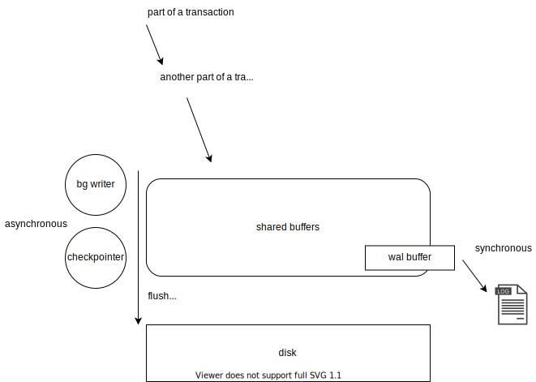

# Exploring Postgres Write Ahead Logs (WAL)

I interact with Postgres on a daily basis, albeit typically managed by a service provider like [AWS RDS](https://docs.aws.amazon.com/AmazonRDS/latest/UserGuide/CHAP_GettingStarted.CreatingConnecting.PostgreSQL.html#CHAP_GettingStarted.Creating.PostgreSQL). Hot take - here you pay a premium for RDS to accomodate the luxury of your ignorance - rightfully so. RDS abstracts the internals of Postgres allowing you to view it more and more like an intuitive store of data rather than dwelling on the implementation details.

Some **features** of personal interest these services typically offer are:

- Point in time recovery (PITR)
- Heated (or ready to go) backup replica's
- Logical replication

I learnt however that these are offered via proxy of _ease_ rather than PostgresQL component expansion.

With this study into Postgres WAL recently and it has given me the ability to clearly appreciate Postgres providing service's offerings.

# WAL Introduction

Database systems intend to garantuee _data validity_. In turn we find that this directly assumes that database transactions (units of change done) behave **correctly**. Correctly here is defined by four properties known as [ACID](https://en.wikipedia.org/wiki/ACID). WAL is a technique that directly targets [atomocity](<https://en.wikipedia.org/wiki/Atomicity_(database_systems)>) and [durability](<https://en.wikipedia.org/wiki/Durability_(database_systems)>).

With such a significant influence on the _data validity_ of a database system, you can understand my interest in it.

**WAL in Postgres - all modifications are written to a log before they are applied. Both redo and undo information is stored in the log.**

_Where do they live:_

```
 % docker-compose up --detach postgres
Creating network "postgres-wal_default" with the default driver
Creating postgres-wal_postgres_1 ... done
 % docker-compose exec postgres bash
root@5bfadf672170:/# cd $PGDATA/pg_wal
root@5bfadf672170:/var/lib/postgresql/data# ls -l
total 16388
-rw------- 1 postgres postgres 16777216 Oct 17 21:59 000000010000000000000001
drwx------ 2 postgres postgres     4096 Oct 17 21:59 archive_status
```

_Notes_:

- [LSN](https://www.postgresql.org/docs/14/datatype-pg-lsn.html) derived filename convention here, leading 8 hexadecimal values represent a time element (epoched to when the DB cluster first started). Remaining 16 values increment as needed.
- WAL files are binary files with allocation of 16MB - this is changeable.

You can `--follow` these WAL files;

```
root@5bfadf672170:/var/lib/postgresql/data/pg_wal# pg_waldump 000000010000000000000001 -f
```

And in another terminal create DB changes

```
 % pgcli -h localhost -U postgres postgres
Password for postgres:
Server: PostgreSQL 14.0 (Debian 14.0-1.pgdg110+1)
Version: 3.2.0
Home: http://pgcli.com
postgres@localhost:postgres> CREATE TABLE tmp(val int);
CREATE TABLE
Time: 0.005s
postgres@localhost:postgres> INSERT INTO tmp(val) SELECT g.id FROM generate_series(1, 10) as g(id);
INSERT 0 10
Time: 0.005s
```

You can see how these WAL files are written before the query is returned in the earlier terminal session.

## Why do we have WAL files?

tldr: faster when adhering to strict data integrity requirements.

> If we follow this procedure, we do not need to flush data pages to disk on every transaction commit, because we know that in the event of a crash we will be able to recover the database using the log: any changes that have not been applied to the data pages can be redone from the log records. (This is roll-forward recovery, also known as REDO.)
> \- [documentation](https://www.postgresql.org/docs/14/wal-intro.html)



- `checkpointer` hard limit (max 2min) adhering dirty buffer flusher at intervals. **pauses everything**, figures out what it can and can not flush.
- `background writer` flushes based on LRU algo increasing clean pages to go around cheaply.

## Streaming these WAL files (principle behind backups)

Postgres exports a utility [`pg_receivewal`](https://www.postgresql.org/docs/14/app-pgreceivewal.html) that acts as a read once, immutable [message queue](https://en.wikipedia.org/wiki/Message_queue) allowing you to _stream_ these wall files to.. anywhere (for example archiving).

```
 % docker-compose exec postgres bash
root@03c55a788579:/# su postgres
postgres@03c55a788579:/$ cd $PGDATA/
postgres@03c55a788579:~/data$ cd ..
postgres@03c55a788579:~$ mkdir stream
postgres@03c55a788579:~$ pg_receivewal -D stream/
```

In another terminal you can view these files

```
root@03c55a788579:/# ls -l $PGDATA/../stream/
total 16384
-rw------- 1 postgres postgres 16777216 Oct 17 23:36 000000010000000000000001.partial
```

`.partial` files are actively streaming the current WAL file being written to. Once this `WAL` file is either filled up or switched for example;

```
postgres@localhost:postgres> select pg_switch_wal();
+-----------------+
| pg_switch_wal   |
|-----------------|
| 0/16FAC80       |
+-----------------+
SELECT 1
Time: 0.041s
```

You'll notice

```
root@03c55a788579:/# ls -l $PGDATA/../stream/
total 32768
-rw------- 1 postgres postgres 16777216 Oct 17 23:41 000000010000000000000001
-rw------- 1 postgres postgres 16777216 Oct 17 23:41 000000010000000000000002.partial
```

Although this is just simple archiving, you will see how this is an important concept to know about when it comes to general archiving, backing up and interestingly, the fundamental tool behind: [DB replication](https://www.postgresql.org/docs/14/runtime-config-replication.html).

## Replication Servers

Colloquially known as [replication slots](https://www.postgresql.org/docs/9.4/catalog-pg-replication-slots.html), are mechanisms that more formally wrap `pg_receivewal` that offers easy replication connections with the aim of providing a consistent interface among replication connectors.

You can create these replication slots via

```
postgres@localhost:postgres> select * from pg_create_physical_replication_slot('replica');
+-------------+--------+
| slot_name   | lsn    |
|-------------+--------|
| replica     | <null> |
+-------------+--------+
SELECT 1
Time: 0.018s
postgres@localhost:postgres> select slot_name, active from pg_replication_slots
+-------------+----------+
| slot_name   | active   |
|-------------+----------|
| replica     | False    |
+-------------+----------+
SELECT 1
Time: 0.009s
```

Interestingly, you can also use `pg_receivewal` to stream WAL files to somewhere too! Which technically chains `pg_receivewal`. `-S, --slot-name` to point to a replication slot.

```
postgres@993e83a382c4:~$ pg_receivewal -D stream/ -S replica
```

## Logical Replication

By default WAL file provides just enough information for basic replica support, which writes enough data to support WAL archiving and replication, including running read-only queries on a standby server. This is informed _physically_ which uses exact block addresses and byte-by-byte replication. We can change the `wal_level` to allow logical decoding of the WAL files allowing a more generic consumer ([difference between logical and physical replication](https://www.postgresql.org/docs/14/logical-replication.html)).

_edit `postgres.conf` to change [`wal_level`](https://www.postgresql.org/docs/14/runtime-config-wal.html)_

```
root@73d37a504686:/# cd $PGDATA/
root@73d37a504686:/var/lib/postgresql/data# vim postgresql.conf
```

_inside `postgresql.conf`_

1. search "WRITE-AHEAD LOG"
2. find option `wal_level` and change this to `logical`

_Let postgres cluster react to this config change by cluster restart_

```
root@73d37a504686:/var/lib/postgresql/data# su postgres
postgres@73d37a504686:~/data$ pg_ctl restart
waiting for server to shut down....
 % docker-compose up postgres
```

`pg_receivewal` works just the same, you will just notice each log line containing added logical language describing what has happened. We can extract and interpret these WAL files via [`pg_recvlogical`](https://www.postgresql.org/docs/14/app-pgrecvlogical.html) although `pg_recvlogical` relies on replication slots directly, (ie we cannot directly wrap `pg_receivewal`).

We can use `pg_recvlogical` directly to create a logical replication slot;

```
su postgres
pg_recvlogical -d postgres --slot extract --create-slot
pg_recvlogical -d postgres --slot extract --start -f -
```

_Notice: logical streams differentiate logs from different databases_

_inserting some stuff into `postgres` database_

```
 % pgcli -h localhost -U postgres postgres
Password for postgres:
Server: PostgreSQL 14.0 (Debian 14.0-1.pgdg110+1)
Version: 3.2.0
Home: http://pgcli.com
postgres@localhost:postgres> create table tmp(val int);
CREATE TABLE
Time: 0.006s
postgres@localhost:postgres> INSERT INTO tmp(val) SELECT g.id FROM generate_series(1, 10) as g(id);
INSERT 0 10
Time: 0.006s
```

And in the previous terminal you will notice logical output of what is happening, far easier to understand than the physical level logging we got before.

```
BEGIN 736
table public.tmp: INSERT: val[integer]:1
table public.tmp: INSERT: val[integer]:2
table public.tmp: INSERT: val[integer]:3
table public.tmp: INSERT: val[integer]:4
table public.tmp: INSERT: val[integer]:5
table public.tmp: INSERT: val[integer]:6
table public.tmp: INSERT: val[integer]:7
table public.tmp: INSERT: val[integer]:8
table public.tmp: INSERT: val[integer]:9
table public.tmp: INSERT: val[integer]:10
COMMIT 736
```

Now ofcourse you can do this inside Postgres via [`pg_create_logical_replication_slot` (see Replication Functions)](https://www.postgresql.org/docs/9.4/functions-admin.html).

Since you've already created a replication slot above - you can utulise it right away (seek more complete example [here](https://www.postgresql.org/docs/14/logicaldecoding-example.html));

```
postgres@localhost:postgres> -- \df pg_logical_slot_get_changes
postgres@localhost:postgres> SELECT * FROM pg_logical_slot_get_changes('extract', NULL, NULL);
+-------+-------+--------+
| lsn   | xid   | data   |
|-------+-------+--------|
+-------+-------+--------+
SELECT 0
Time: 0.018s
postgres@localhost:postgres> INSERT INTO tmp(val) SELECT g.id FROM generate_series(1, 10) as g(id);
INSERT 0 10
Time: 0.006s
postgres@localhost:postgres> SELECT * FROM pg_logical_slot_get_changes('extract', NULL, NULL);
+-----------+-------+-------------------------------------------+
| lsn       | xid   | data                                      |
|-----------+-------+-------------------------------------------|
| 0/17143F8 | 737   | BEGIN 737                                 |
| 0/17143F8 | 737   | table public.tmp: INSERT: val[integer]:1  |
| 0/1714748 | 737   | table public.tmp: INSERT: val[integer]:2  |
| 0/1714788 | 737   | table public.tmp: INSERT: val[integer]:3  |
| 0/17147C8 | 737   | table public.tmp: INSERT: val[integer]:4  |
| 0/1714808 | 737   | table public.tmp: INSERT: val[integer]:5  |
| 0/1714848 | 737   | table public.tmp: INSERT: val[integer]:6  |
| 0/1714888 | 737   | table public.tmp: INSERT: val[integer]:7  |
| 0/17148C8 | 737   | table public.tmp: INSERT: val[integer]:8  |
| 0/1714908 | 737   | table public.tmp: INSERT: val[integer]:9  |
| 0/1714948 | 737   | table public.tmp: INSERT: val[integer]:10 |
| 0/17149B8 | 737   | COMMIT 737                                |
+-----------+-------+-------------------------------------------+
SELECT 12
Time: 0.015s
postgres@localhost:postgres> SELECT * FROM pg_logical_slot_get_changes('extract', NULL, NULL);
+-------+-------+--------+
| lsn   | xid   | data   |
|-------+-------+--------|
+-------+-------+--------+
SELECT 0
Time: 0.016s
```

#### As JSON changesets

Via [`wal2json`](https://github.com/eulerto/wal2json) via `-P, --plugin` flag.

```
su postgres
pg_recvlogical -d postgres --slot test_slot --create-slot -P wal2json
pg_recvlogical -d postgres --slot test_slot --start -o pretty-print=1 -o add-msg-prefixes=wal2json -f -
```

And you will now receive more rich, json messages. Typically you'll find most event queues utulise this output format.

# Publication

[Publication](https://www.postgresql.org/docs/14/logical-replication-publication.html)'s abstract all details above, that is, WAL file -> logical changeset conversion & replication slot management, and pairs it with fine grain publishing controls specifc to tables and even specified change events (`INSERT`, `DELETE`, etc...). This, alongside the idiom of a _publication_ make this an intuitive tool to use for pub/sub architectures where one DB subscribes to another DB's table.

Only you're the wiser, and you know exactly what is going on under the hood by now.

_A demonstration nevertheless_
```
postgres@localhost:postgres> CREATE TABLE gizmos(val int);
CREATE TABLE
Time: 0.005s
postgres@localhost:postgres> CREATE PUBLICATION gizmo_pub FOR TABLE gizmos;
CREATE PUBLICATION
Time: 0.004s
```

_In another terminal_
```
 % docker-compose up --detach subscriber
postgres-wal_subscriber_1 is up-to-date
 % pgcli -p 5433 -h localhost -U subscriber postgres
Password for subscriber:
Server: PostgreSQL 14.0 (Debian 14.0-1.pgdg110+1)
Version: 3.2.0
Home: http://pgcli.com
postgres> CREATE TABLE gizmos(val int);
postgres> CREATE SUBSCRIPTION gizmo_sub CONNECTION 'dbname=postgres host=postgres port=5432 password=password' PUBLICATION gizmo_pub;
NOTICE:  created replication slot "gizmo_sub" on publisher

CREATE SUBSCRIPTION
Time: 0.023s
```

Now you can insert into this table from two places, every change event propogates to `gizmos` table in the "subscriber" host.

## Streaming into an event queue example
We've done a lot at this point, it's easy to see how we could extend this with a quick code example where we use a `PUBLICATION` to capture change events and place them onto some sort of queue.

```
go run .
```

# Interesting utulisations of knowledge above

- unlogged tables (why you would)
- asynchronous commits
- publications
